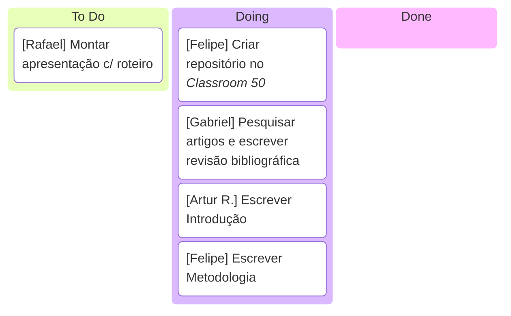

# TI5 - LLM LoadBalancer

- Artur Fernandes Braga de Menezes
- Artur Rizzi Martinho
- Felipe Lacerda Tertuliano
- Gabriel Alves da Silva Diógenes
- Rafael Mortimer Colares

## Cronograma



## Links

> [Atigo (overleaf)](https://www.overleaf.com/5344664863vpbcpygzymjm#28a138)

> [Repositório (GitHub)](https://http.cat/status/307)

> [Classroom 50](https://classroom50.org/ICEI-PUC-Minas-CC-TI/plmg-cc-2026-2-ti5/assignments/plmg-cc-2026-2-ti5/accept)

## Como Executar

### 1. Criar o ambiente virtual

No terminal, dentro da pasta do projeto, execute:

```bash
python -m venv .venv
```

> **Obs:** em alguns sistemas o comando pode ser `python3` em vez de `python`.

### 2. Ativar o ambiente virtual

Escolha o comando de acordo com o seu sistema operacional:

**Windows:**

```bash
.venv\Scripts\activate
```

**Linux / macOS:**

```bash
source .venv/bin/activate
```

### 3. Instalar as dependências

Com o ambiente virtual ativado, execute:

```bash
pip install -e ".[dev]"
```

### 4. Executar os testes

```bash
pytest
```

### 5. Executar o programa

```bash
python -m src
```

> **Obs:** em alguns sistemas o comando pode ser `python3` em vez de `python`.
